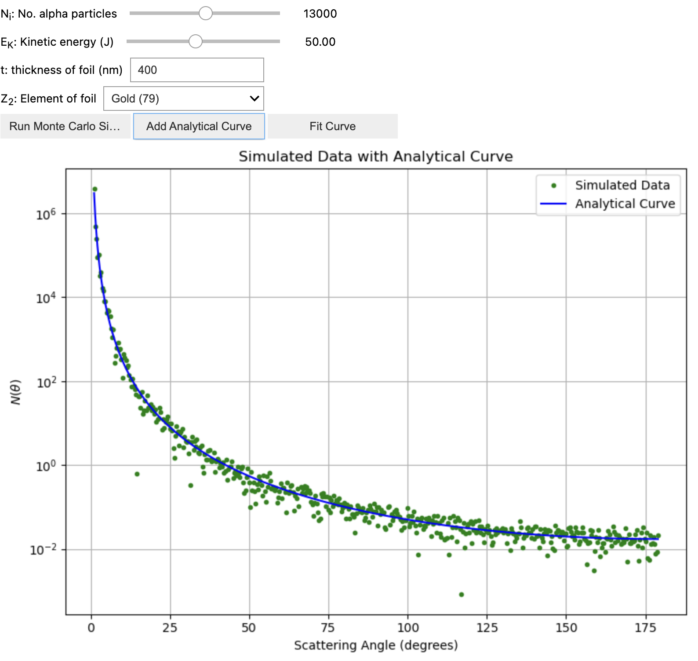
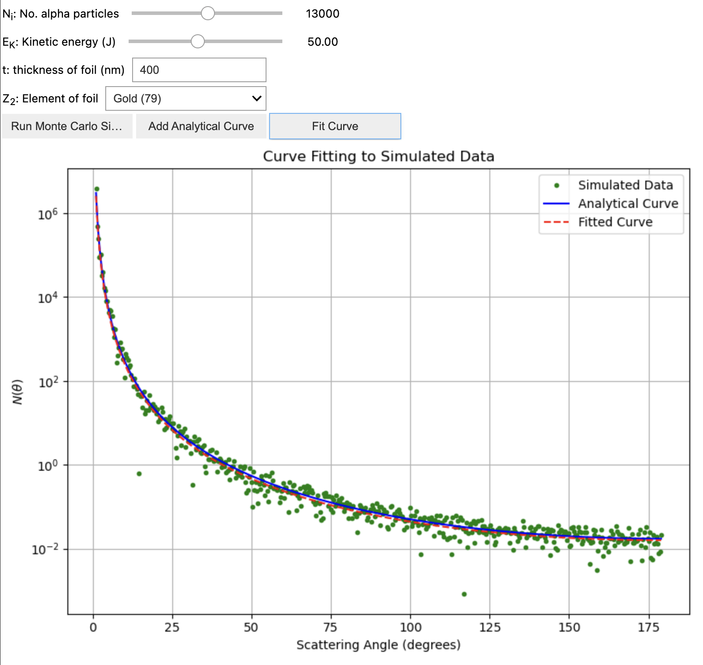

# Rutherford Scattering Simulation

This project simulates Rutherford scattering using Monte Carlo methods. It provides an interactive interface to explore the scattering behavior of alpha particles when they pass through a thin foil. The simulation includes options for adding an analytical curve and a fit curve for comparison. Various parameters such as the number of alpha particles, kinetic energy (KE), foil thickness, and the element of the foil can be adjusted dynamically using sliders.

## Features
- **Monte Carlo Simulation**: Simulates the scattering of alpha particles.
- **Analytical Curve**: Adds a theoretical curve to the simulation for comparison.
- **Fit Curve**: Computes and overlays a fit curve for the simulated data.
- **Interactive Sliders**: Adjust key parameters such as:
  - Number of alpha particles
  - Kinetic energy (KE)
  - Thickness of the foil
  - Element of the foil (e.g., gold, silver, etc.)

## Requirements
To run the project, you need:

- Python 3.10 or later
- Required Python libraries (install using `pip`):
  - `numpy`
  - `matplotlib`
  - `scipy`
  - `ipywidgets` (for interactive sliders)

## Usage
Run the Python script to start the simulation:
```bash
python rutherford_simulation.py
```

### User Interface
1. **Adjust Parameters**:
   - Use sliders to modify:
     - Number of alpha particles
     - Kinetic energy (KE)
     - Foil thickness
     - Element of the foil
2. **Add Analytical Curve**:
   - Click the "Add Analytical Curve" button to display the theoretical curve.
3. **Add Fit Curve**:
   - Click the "Add Fit Curve" button to compute and display a fit curve based on the simulated data.

### Screenshots






## Theory
The simulation is based on the principles of Rutherford scattering, where alpha particles interact with the nucleus of atoms in the foil. The Monte Carlo approach is used to randomly sample scattering angles based on the Rutherford scattering formula:

$$
N(\theta) = \frac{N_i a t}{16 r^2} \left( \frac{Z_1 Z_2 e^2}{4 \pi \epsilon_0 E_K} \right)^2 \csc^4 \left( \frac{\theta}{2} \right)
$$

where:
- $N_i$ = Number of alpha particles
- t = Thickness of foil
- a = Number of atoms per unit volume
- r = Distance from detector to sheet
- $\theta$ = Angle
- $Z_1$ = 2
- $Z_2$ = Atomic number of scattering foil
- $e$ = Elementary Charge
- $\epsilon_0$ = Vacuum permittivity
- $E_K$ = 1/2 $Mv^2$
- $M$ = Mass of alpha particle
- $v$ = Speed of alpha particle

## Acknowledgments
- Inspired by Rutherford's experiments.
- Thanks to open-source libraries and the Python community.

## Contact
For any questions or suggestions, please contact:
- **Kasturi Nirmalan**
- Email: kasturinirmalan09@gmail.com
- GitHub: [Kasturi-Nirmalan](https://github.com/Kasturi-Nirmalan)
