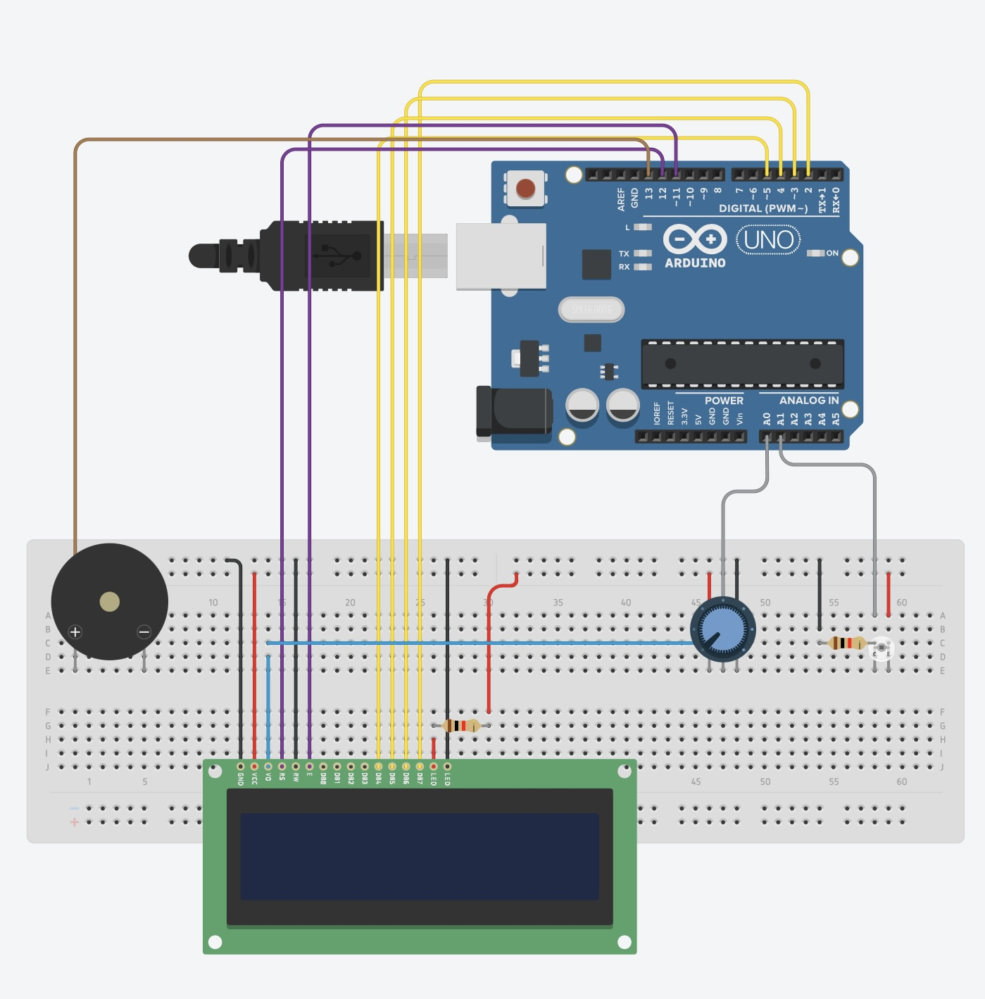
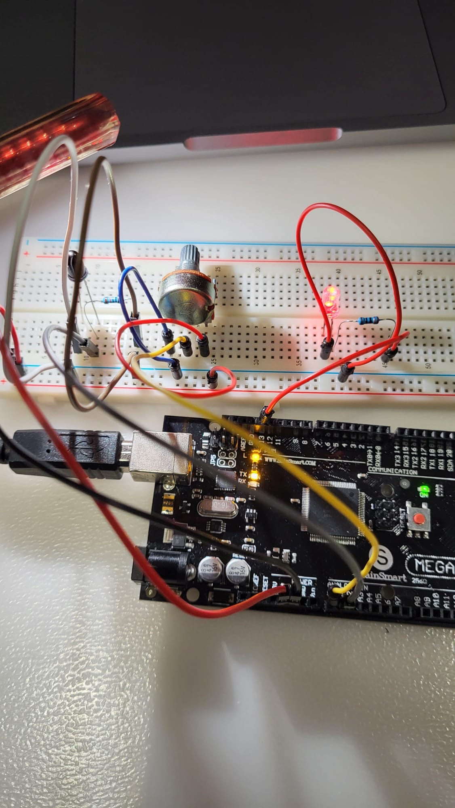

# Ionizing Radiation Simulator and Monitoring System

## Overview

The **Ionizing Radiation Simulator and Monitoring System** simulates the behavior of ionizing radiation detectors (such as Geiger counters) using an Arduino, a phototransistor, a potentiometer, an LCD display, and a buzzer/LED. The phototransistor detects light intensity, simulating the detection of radiation particles like photons or electrons. The system visualizes the detected radiation intensity on the LCD screen and triggers an alarm using the buzzer if the radiation level exceeds a certain threshold or if using the LED, the bulb will turn on if it detects light (opposite to that of a LDR).

This project demonstrates how to create a basic radiation detection system using simple electronics and programming concepts.

---

## Components

- **Arduino Mega 2560** (or any compatible Arduino)
- **NPN Phototransistor**
- **Potentiometer** (for sensitivity adjustment)
- **LCD Display** (16x2 or similar, without I2C)
- **Electromagnetic PCB Buzzer/LED**
- **Resistors** (10kΩ for pull-down resistor)
- **Breadboard** and **Jumper Wires**

---

## How It Works

### Phototransistor as a Radiation Detector

The **phototransistor** functions as a light sensor that simulates the detection of radiation particles. As the intensity of light increases, the output voltage from the phototransistor increases, which is read by the Arduino via its analog input pin.

- When more light hits the phototransistor (simulating more radiation), the value increases.
- When the light is blocked (simulating less radiation), the value decreases.

### Potentiometer for Sensitivity Adjustment

The **potentiometer** is connected to another analog input pin. Turning the potentiometer changes the system's sensitivity, adjusting how much light is needed to trigger the threshold. Higher sensitivity means smaller changes in light will trigger actions, while lower sensitivity requires larger light variations.

### Arduino Processing

The Arduino reads the analog signal from the phototransistor and maps it to a range from 0 to 1023. The code continuously checks the light intensity and compares it to the threshold value (adjusted by the potentiometer). 

- If the radiation level exceeds the threshold, the Arduino will activate the **buzzer**.
- The **LCD** will display the current radiation level.

### LCD Display

The LCD displays the simulated radiation level as a number. This helps visualize how the light intensity fluctuates, simulating the presence of ionizing radiation.

### Buzzer Alarm/LED

If the radiation level exceeds a preset threshold, the **buzzer** will sound or the **LED** will turn on, alerting the user to higher radiation levels (simulated).

---

## Wiring the Circuit



### Phototransistor

1. **Collector** of the phototransistor to **5V**.
2. **Emitter** of the phototransistor to **A0** (Analog Pin) on the Arduino.
3. A **10kΩ pull-down resistor** between **Emitter (E)** and **GND**.

### Potentiometer

1. One side to **5V**.
2. The other side to **GND**.
3. The wiper (middle pin) to **A1** (Analog Pin) on the Arduino.

### LCD Display

1. **VSS** to **GND**.
2. **VDD** to **5V**.
3. **V0** to **GND** (optional: connect to a potentiometer for contrast control).
4. **RS** to **Pin 12**.
5. **RW** to **GND**.
6. **E** to **Pin 11**.
7. **D4** to **Pin 5**.
8. **D5** to **Pin 4**.
9. **D6** to **Pin 3**.
10. **D7** to **Pin 2**.
11. **A** to **5V** (backlight positive).
12. **K** to **GND** (backlight negative).

### Buzzer/LED

1. **One pin** of the buzzer to **Pin 13** (digital output).
2. **Other pin** to **GND**.

---

## Arduino Code

The Arduino code reads the phototransistor value, adjusts the threshold based on the potentiometer, and displays the data on the LCD. If the radiation level exceeds the threshold, the buzzer is activated.

```cpp
#include <LiquidCrystal.h>

// Pin Definitions for LCD and Buzzer
int phototransistorPin = A1; // Phototransistor on A1
int potentiometerPin = A0;  // Potentiometer on A0
int buzzerPin = 13;         // Buzzer on pin 13

// Initialize LCD: RS=12, E=11, D4=5, D5=4, D6=3, D7=2
LiquidCrystal lcd(12, 11, 5, 4, 3, 2);

void setup() {
  Serial.begin(9600);       // Initialize Serial Monitor
  pinMode(buzzerPin, OUTPUT); // Set buzzer pin as output

  // LCD Initialization
  lcd.begin(16, 2);          // Initialize the LCD with 16 columns and 2 rows
  lcd.setCursor(0, 0);       // Set cursor to first row
  lcd.print("Radiation:");    // Static text on the first line
}

void loop() {
  int lightLevel = analogRead(phototransistorPin); // Read phototransistor
  int threshold = analogRead(potentiometerPin);    // Read potentiometer

  // Update LCD Display
  lcd.setCursor(0, 1);        // Move cursor to the second line
  lcd.print("          ");    // Clear the line (10 spaces)
  lcd.setCursor(0, 1);        // Reset cursor to the start of the second line
  lcd.print(lightLevel);      // Print the light level value

  // Serial Monitor Output
  Serial.print("Light level: ");
  Serial.print(lightLevel);
  Serial.print(" Threshold: ");
  Serial.println(threshold);

  // Activate buzzer based on threshold with tone() function
  if (lightLevel > threshold) {
    tone(buzzerPin, 1000);  // Play a 1000 Hz tone when the light level exceeds the threshold
  } else {
    noTone(buzzerPin);      // Stop the tone when the light level is below the threshold
  }

  delay(200); // Small delay for stable readings
}

```

## Process of making the project

### Phototransistor and LED circuit


### Phototransistor with added Potentiometer




### With LCD screen (using a LED - can be replaced with buzzer)


